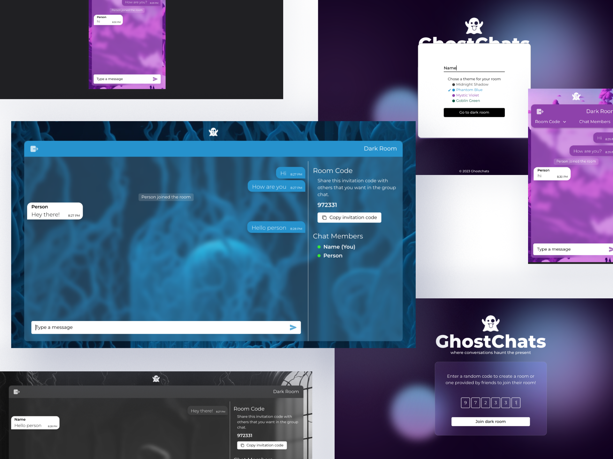
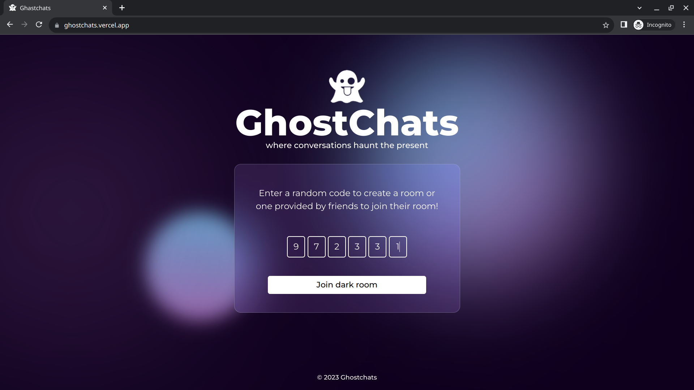
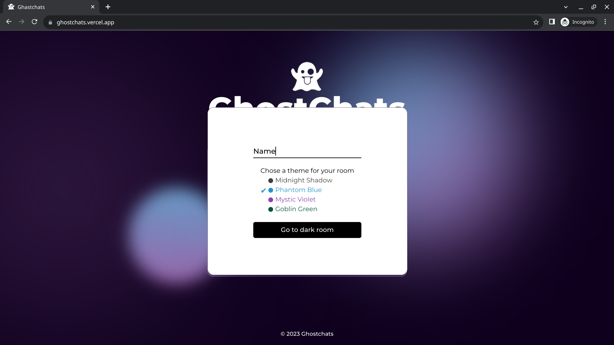
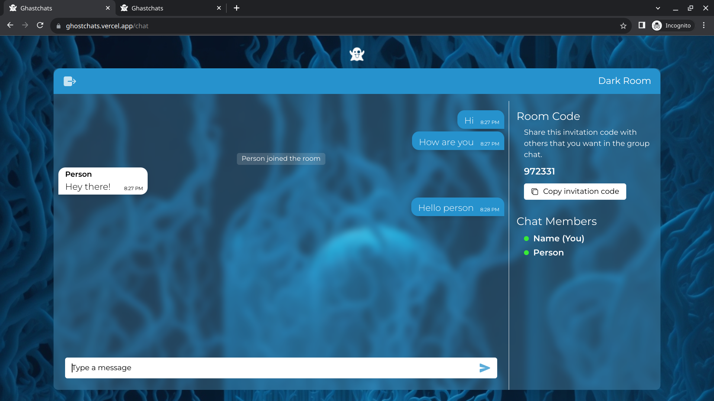
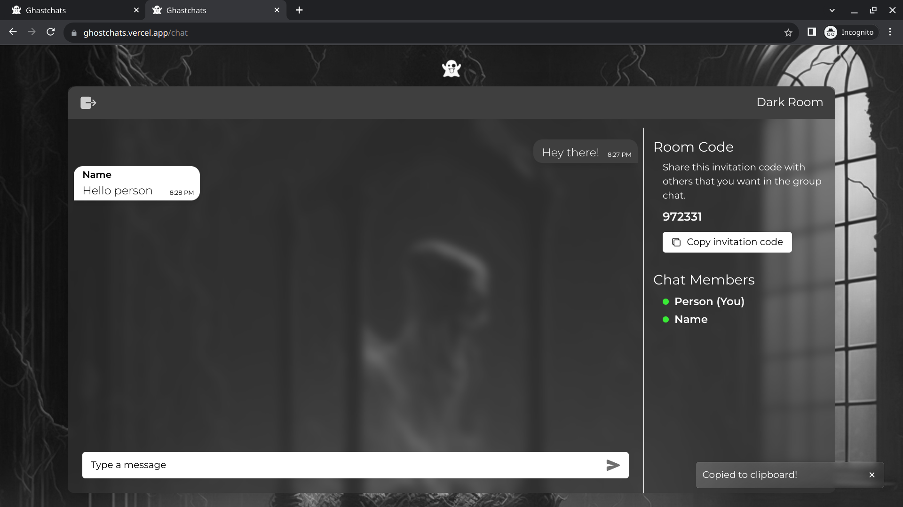
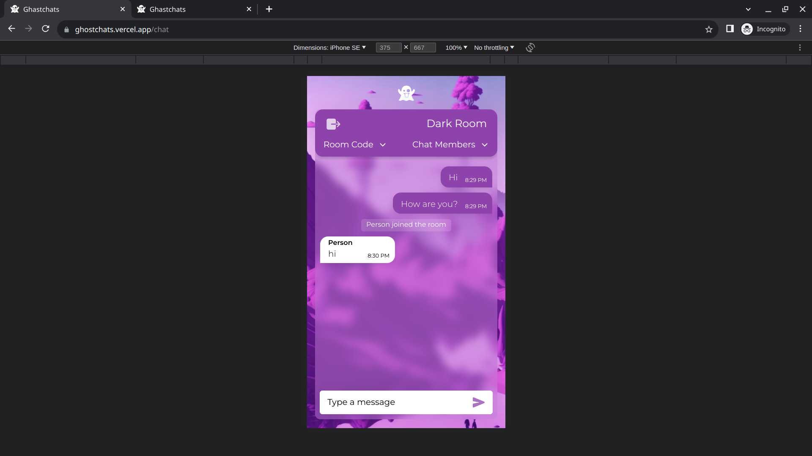

# :star: GhostChats

  

GhostChat is an group chat platform that allows you to create private rooms and engage in secure, anonymous conversations. With GhostChat, you can generate unique codes, share them with others, and experience the thrill of ghostly connections. Once the window closes, all traces vanish, leaving no digital footprints behind.

## TABLE OF CONTENTS

- [Important Links](#important-links)
- [Configuration for Local Deployment](#configuration-for-local-deployment)
- [Tech Stack](#tech-stack)
- [Usage and Features](#usage-and-features)
- [Screenshots](#screenshots)

## Important Links

- website LIVE @ https://ghostchats.vercel.app/
- CLIENT repo @ https://github.com/alvin1904/ghostchats-client
- API repo @ https://github.com/sm0483/ghostchats-api

## Configuration for Local Deployment

To deploy `GHOSTCHATS` on your local machine, follow these steps:

1. Clone the repository to your local machine
   `git clone git@github.com:alvin1904/ghostchats-client.git`
   and cd into the directory.
2. Install the required dependencies. Make sure you have Node.js and npm (Node Package Manager) installed.
3. Navigate to the project directory and run the following command:
   `npm install`
4. Copy the `.env.example` file to `.env.local` and update the necessary values.
5. `npm run dev` to start the client at localhost:3000

## Tech Stack

- `HTML, CSS & NEXT Js.` , based on REACT Js., for front-end UI and client-side logic
- `Typescript` for type safety & code quality
- `react-icons` for adding icons to UI
- `socket.io-client`: for web-socket based communication with server
- `sharp`: for image processing and manipulation features

## Usage and Features

- Create or Enter into private chat rooms with unique codes
- Engage in secure, anonymous conversations
- No digital footprints left behind after the chat window closes
- Choose from 4 different elegant chat themes
- Fast socket communication for real-time chatting

## Screenshots

